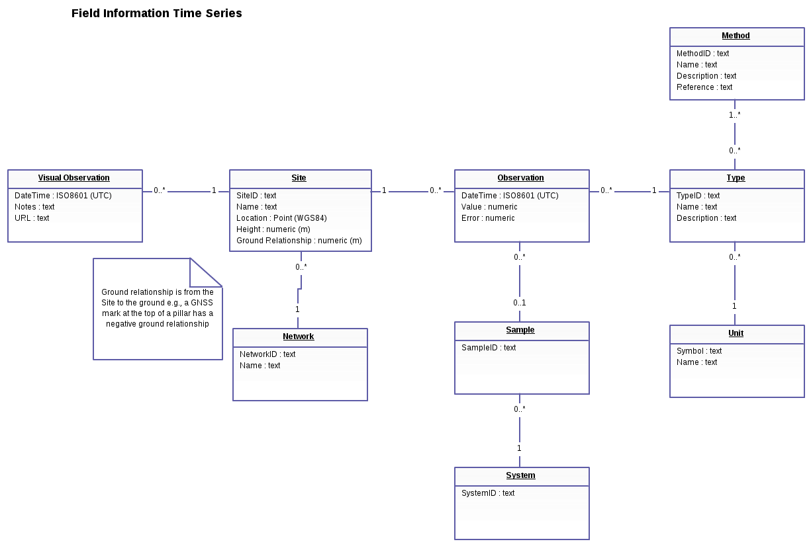

# FITS

Field Time Series data.

[](https://snap-ci.com/GeoNet/fits/branch/master)
[](https://quay.io/repository/geonet/fits)

## Development 

Requires Go 1.3 or newer.

### Dependencies and Compilation

Dependencies are included in this repo using godep vendoring.  There should be no need to `go get` the dependencies 
separately unless you are updating them.

* Install godep https://github.com/tools/godep
* Prefix go commands with godep.

Run:

```godep go build && ./fits```

Run all tests (including any in sub dirs):

```godep go test ./...```

### Database

You will need Postgres 9.x+ and Postgis 2+.  

You can then init the DB and load a small amount of test data with:

```
cd scripts; ./initdb.sh
```

#### Logical Model

The database logical model.


